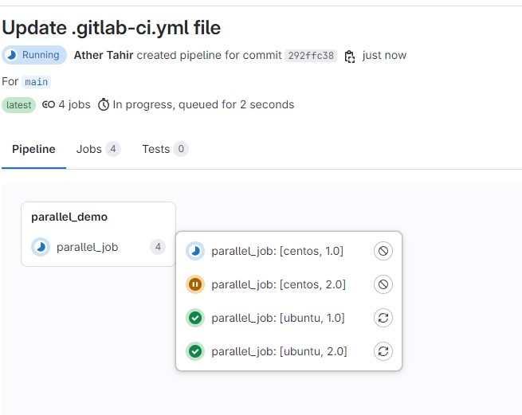
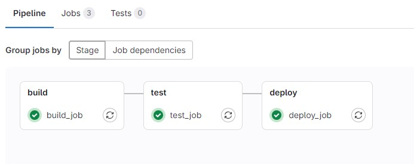
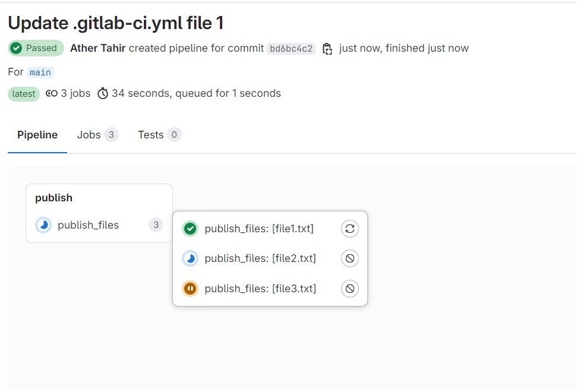

## Lab 2: Parallel and Sequential Pipeline Execution

### Overview

This lab will guide you through:
1. Setting up **parallel jobs** using **matrix configurations**.
2. Configuring **sequential pipelines** and managing job **dependencies**.
3. Running a demo to publish files to an automation account.

By the end of this guide, you will be able to implement both parallel and sequential job execution in GitLab CI/CD to optimize pipeline performance and control job flow effectively.

---

### Prerequisites

1. Basic understanding of GitLab CI/CD.
2. A GitLab repository to work with.
3. Access to GitLab CI/CD runners.

---

## Part 1: Setting Up Parallel Job Execution with Matrix Configuration

### 1.1 What is Parallel Job Execution?

Parallel job execution allows multiple jobs to run simultaneously, reducing total pipeline time. This is useful when you need to test multiple environments, versions, or configurations.

### 1.2 Matrix Configuration in GitLab

GitLab allows you to configure multiple variables within a single job definition, creating a matrix of jobs that execute in parallel.

### 1.3 Lab Setup

In this section, we’ll set up a parallel job that tests multiple operating systems and versions.

#### Step-by-Step Guide

1. **Define Matrix Variables**:
   - Matrix variables allow you to create combinations of jobs based on defined values.

2. **Create `.gitlab-ci.yml` Configuration**:

```yaml
stages:
  - parallel_demo

parallel_job:
  stage: parallel_demo
  script:
    - echo "Running tests on OS:$TEST_OS and Version $TEST_VERSION!"
  parallel:
    matrix:
      - TEST_OS: ["ubuntu", "centos"]
        TEST_VERSION: ["1.0", "2.0"]
```

3. **Explanation**:
   - The `parallel` keyword with `matrix` allows defining combinations of `TEST_OS` and `TEST_VERSION`.
   - GitLab will automatically create parallel jobs for each OS and version combination, speeding up the pipeline by running these tests simultaneously.

4. **Execute the Pipeline**:
   - Commit the `.gitlab-ci.yml` file and push to GitLab. Observe the jobs running in parallel under the `test` stage.



---

## Part 2: Configuring Sequential Pipelines with Dependencies

### 2.1 What are Sequential Pipelines?

Sequential pipelines are pipelines where jobs run in a specified order. This can be achieved by setting **job dependencies** in GitLab, ensuring that a job only starts after its dependencies have completed.

### 2.2 Controlling Job Dependencies in GitLab

GitLab uses the `needs` keyword to specify dependencies, allowing more precise control over job execution order.

### 2.3 Lab Setup

In this part, we’ll create a sequential pipeline with three stages: **build**, **test**, and **deploy**. Each stage will depend on the successful completion of the previous stage.

#### Step-by-Step Guide

1. **Define Stages and Jobs**:

```yaml
stages:
  - build
  - test
  - deploy

build_job:
  stage: build
  script:
    - echo "Building the application..."
    - sleep 5 # Simulate build time
  artifacts:
    paths:
      - build/

test_job:
  stage: test
  needs: ["build_job"]
  script:
    - echo "Testing the application..."
    - sleep 5 # Simulate test time

deploy_job:
  stage: deploy
  needs: ["test_job"]
  script:
    - echo "Deploying the application..."
    - sleep 5 # Simulate deploy time
```

2. **Explanation**:
   - `needs` specifies that `test_job` depends on `build_job`, and `deploy_job` depends on `test_job`.
   - GitLab executes these jobs sequentially as defined by the dependencies.

3. **Execute the Pipeline**:
   - Push this configuration to GitLab and observe the sequential execution of stages.



---

## Part 3: Demo – Publishing Files to an Automation Account Using Parallel Jobs

### 3.1 Scenario

This demo shows how to configure parallel jobs to publish files to an automation account. Each job will handle a specific file and execute in parallel to speed up the publishing process.

### 3.2 Lab Setup

1. **Define Variables and Stages**:
   - Define the files you want to publish and their corresponding publishing commands.

2. **Create `.gitlab-ci.yml` Configuration**:

```yaml
stages:
  - publish

publish_files:
  stage: publish
  script:
    - echo "Simulating publishing $FILE to the automation account..."
    - echo "$FILE successfully published!"
  parallel:
    matrix:
      - FILE: "file1.txt"
      - FILE: "file2.txt"
      - FILE: "file3.txt"
```

3. **Explanation**:
   - Each parallel job will publish a specific file to the automation account, utilizing matrix configuration.
   - **Stages**: We have a single publish stage.
   - **Job** (`publish_files`): This job runs for each file defined in the matrix section.
   - **Script**: Each job echoes a message simulating a "publish" action for the file specified in FILE.
   - **Parallel Execution**: Using matrix, GitLab will run each instance of publish_files with a different FILE in parallel.

4. **Run the Pipeline**:
   - Push this configuration and watch the files being published in parallel.



---

#### Summary

This lab covers:
1. **Parallel Execution** using matrix configurations for faster pipelines.
2. **Sequential Execution** with dependencies for controlled job flows.
3. A **demo** using parallel jobs to publish files efficiently.
