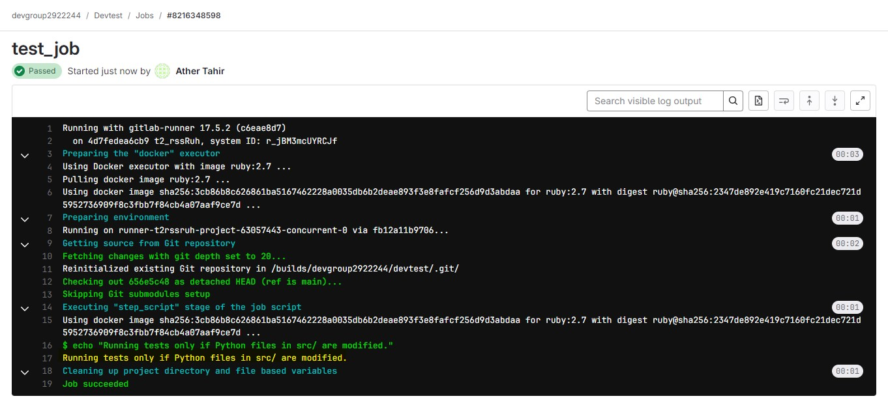

## Lab: Optimizing Pipeline Efficiency

### Overview

This lab will guide you through:
1. Using **conditional job execution** to optimize pipeline performance (e.g., only running jobs when specific files are modified).
2. **Best practices** for pipeline optimization.
3. A **demo** showing how to set up a pipeline job that triggers based on file changes in a merge request.

By the end of this guide, you’ll know how to optimize GitLab pipelines for faster, more efficient performance by minimizing unnecessary job executions.

---

### Prerequisites

1. Basic understanding of GitLab CI/CD and YAML syntax.
2. A GitLab repository to work with.
3. Access to GitLab CI/CD runners.

---

## Part 1: Using Conditional Job Execution to Optimize Pipelines

### 1.1 What is Conditional Job Execution?

Conditional job execution allows certain jobs to run only when specific conditions are met. This is useful for avoiding redundant job executions, which can save time and resources.

### 1.2 Using `only` and `except` in GitLab CI/CD

GitLab provides the `only` and `except` keywords to control when jobs run based on branch names, file changes, or merge request events.

#### Example Syntax

```yaml
example_job:
  script:
    - echo "This job only runs on changes in specific files."
  only:
    changes:
      - src/*.py
      - config/*.yml
```

- **Explanation**: The job only runs if files in `src` or `config` directories change. The `only` keyword here restricts the job to trigger only on file changes.

### 1.3 Lab Setup

We’ll create a pipeline where jobs only run if specific files change.

#### Step-by-Step Guide

1. **Define Conditional Job Execution** in `.gitlab-ci.yml`:

```yaml
stages:
  - test
  - deploy

test_job:
  stage: test
  script:
    - echo "Running tests only if Python files in src/ are modified."
  only:
    changes:
      - src/**/*.py

deploy_job:
  stage: deploy
  script:
    - echo "Deploying only if config files in config/ are modified."
  only:
    changes:
      - config/**/*.yml
```

2. **Creating the Trigger Files in GitLab UI**:

- Go to your GitLab repository.
- Create a new folder named src with a file `main.py` in it, containing any basic Python code, e.g., `print("Hello, World!")`.
- Create another folder config with a file `config.yml` in it, containing sample YAML content, e.g., `setting: true`.

3. **Explanation**:
   - `test_job` only runs if any `.py` file in the `src` directory is modified.
   - `deploy_job` only runs if any `.yml` file in the `config` directory is modified.

4. **Push and Test**:

- Edit `main.py` or `config.yml` through the GitLab UI and commit the changes to trigger the pipeline.
- Verify that only relevant jobs run based on the modified files.




---

## Part 2: Best Practices for Pipeline Optimization

### 2.1 Limit Pipeline Stages and Jobs

Reducing unnecessary stages and jobs can enhance efficiency. Try to keep only essential stages and avoid redundant job duplications.

### 2.2 Use Caching for Dependencies

Utilize GitLab caching to save dependencies between job executions. For example, caching `node_modules` or `pip` packages can save time on repeated installations.

#### Example Caching Setup

```yaml
cache:
  paths:
    - node_modules/
```


### 2.3 Avoid Unnecessary Triggers

Set jobs to run only on specific branches or events. Use `only` and `except` keywords effectively.

---

## Part 3: Demo – Triggering Jobs Based on File Changes in a Merge Request

### 3.1 Scenario

In this demo, we will set up a job that triggers only if there are changes in a specific directory when a merge request is created.

### 3.2 Lab Setup

1. **Define Stages and Jobs**:
   - Create jobs that only trigger on specific changes in merge requests.

2. **Create `.gitlab-ci.yml` Configuration**:

```yaml
stages:
  - build

build_job:
  stage: build
  script:
    - echo "Building project due to changes in src/"
  only:
    - merge_requests
  changes:
    - src/**/*

```


3. Explanation:

- The `build_job` triggers if a merge request contains changes in the src directory.

4. Creating the Trigger Files in GitLab UI:

- Open a new branch in GitLab, create a file in the `src` directory, and commit it.
- Open a merge request for this branch.

5. Run the Pipeline:

- Verify that `build_job` runs when the merge request is created with changes in the src directory.


---

#### Summary

This lab covers:
1. Using conditional job execution to run jobs based on file changes.
2. Best practices for optimizing pipelines, including limiting stages, caching dependencies, and avoiding unnecessary triggers.
3. A demo with a pipeline job that triggers only when specific files are modified in a merge request.

Following these practices will help ensure efficient and effective CI/CD workflows in GitLab.
