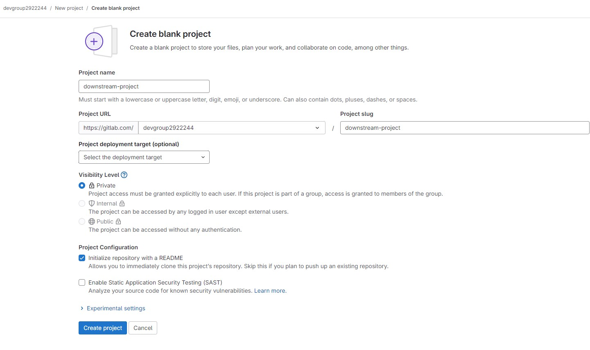
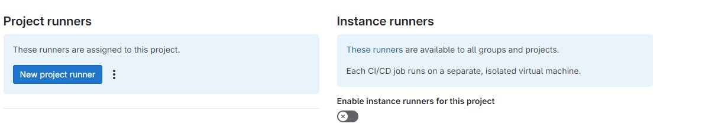
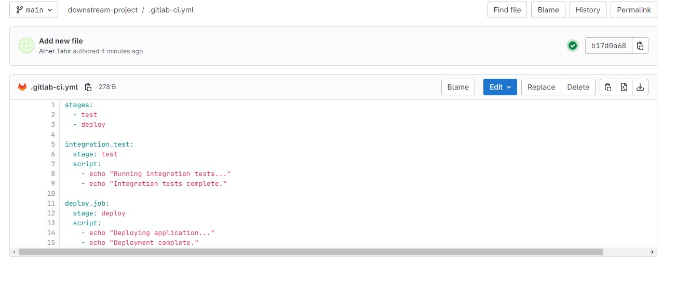
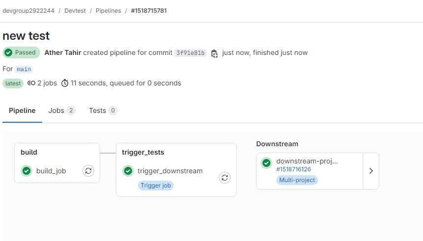
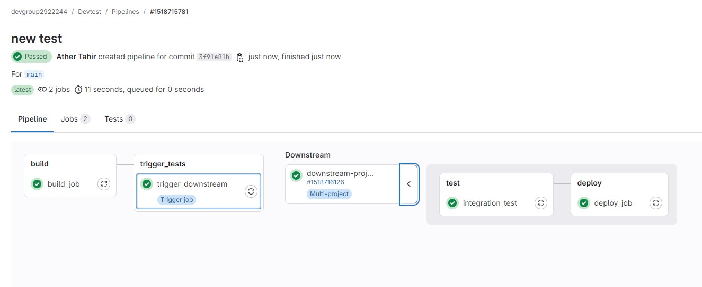

## Lab 4: Downstream Pipelines with the 'Trigger' Keyword

### Overview

This lab covers:
1. **How and when to use downstream pipelines** to break workflows into manageable stages.
2. **Using the `trigger` keyword** to initiate downstream pipelines from within a primary pipeline.

By the end, you will understand how to set up downstream pipelines and manage dependencies between stages using triggers.

---

### Prerequisites

1. Basic familiarity with GitLab CI/CD pipeline configuration.
2. A GitLab repository with CI/CD enabled.

---

## Part 1: Introduction to Downstream Pipelines

### 1.1 What are Downstream Pipelines?

Downstream pipelines allow you to split large workflows into separate, modular pipelines that are triggered by a main, or "upstream," pipeline. This modular approach:
- Helps in organizing complex workflows.
- Reduces interdependence between jobs.
- Allows for independent retries of specific pipelines.

### 1.2 When to Use Downstream Pipelines

- When you need to **divide complex workflows** into smaller segments.
- When some jobs or stages need to **wait for prior pipelines** to complete.
- To **manage dependencies** and only execute certain steps based on conditions met in a prior pipeline.

---

## Part 2: Using the `trigger` Keyword

The `trigger` keyword in GitLab allows you to start a downstream pipeline from within a job in the current pipeline. When combined with rules, you can control when and how these downstream pipelines execute.

### 2.1 Basic Configuration

The `trigger` job definition includes:
- **`trigger` keyword**: Defines the target project and pipeline to trigger.
- **`include` keyword** (optional): Allows you to include files defining the downstream pipeline jobs.
  
---

## Part 3: Demo – Creating a Downstream Pipeline with `trigger`

In this demo, you will:
1. Set up an upstream pipeline with jobs to deploy code.
2. Define a downstream pipeline for tasks like running integration tests.


### 3.1 Setting Up the Downstream Pipeline

**Important:** Create `downstream-project` in the same group and make sure to disable shared runner for this project as well.





In the downstream repository (`your-group/downstream-project`), create the `.gitlab-ci.yml` file with the following configuration:

```yaml
stages:
  - test
  - deploy

integration_test:
  stage: test
  script:
    - echo "Running integration tests..."
    - echo "Integration tests complete."

deploy_job:
  stage: deploy
  script:
    - echo "Deploying application..."
    - echo "Deployment complete."
```



### 3.2 Setting Up the Upstream Pipeline

1. **Create the main pipeline configuration** in `.gitlab-ci.yml` in your repository.

```yaml
stages:
  - build
  - trigger_tests

build_job:
  stage: build
  script:
    - echo "Building application..."
    - echo "Build complete."

trigger_downstream:
  stage: trigger_tests
  trigger:
    project: "your-group/your-downstream-project"  # Replace with actual group and downstream project path
    branch: "main"  # Specify the branch for the downstream pipeline
```

**Explanation**:
- In project: `"your-group/your-downstream-project"`, replace `your-group` with your actual GitLab group name and `your-downstream-project` with the downstream project name.
- This configuration will initiate the downstream pipeline located within the specified group.

2. **Commit and Push Changes** to trigger the upstream pipeline.






### Part 4: Advanced Configuration with Conditional Triggers
Sometimes you may want to only trigger the downstream pipeline under specific conditions, such as:

- Changes in specific files or folders.
- Only in certain branches.

**4.1 Configuring Conditional Trigger**

To only trigger the downstream pipeline if changes were made to a specific directory, modify the trigger job as follows:

```
stages:
  - build
  - trigger_tests

build_job:
  stage: build
  script:
    - echo "Building application..."
    - echo "Build complete."

trigger_downstream:
  stage: trigger_tests
  trigger:
    project: "your-username/downstream-project"
    branch: "main"
  rules:
    - changes:
      - src/**  # Only trigger if changes are made in the src directory
```


### Part 5: Running and Observing the Pipeline

1. Push changes to your upstream repository.

2. Observe the following:
    - The `build_job` runs first.
    - Upon successful completion, `trigger_downstream` initiates the downstream pipeline (if changes are made in `src` directory).
3. Check the downstream project’s pipeline to see the triggered jobs.


#### Summary

This lab covered:

1. How to set up and configure downstream pipelines.
2. Practical examples of using the trigger keyword to manage multi-project workflows.
3. Conditional downstream triggers to optimize workflow efficiency.
