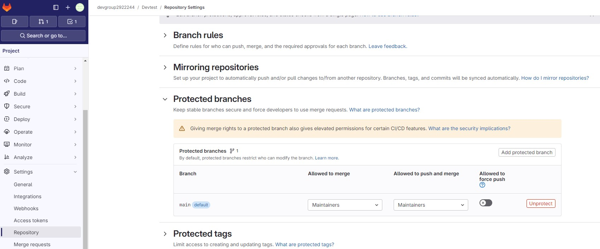
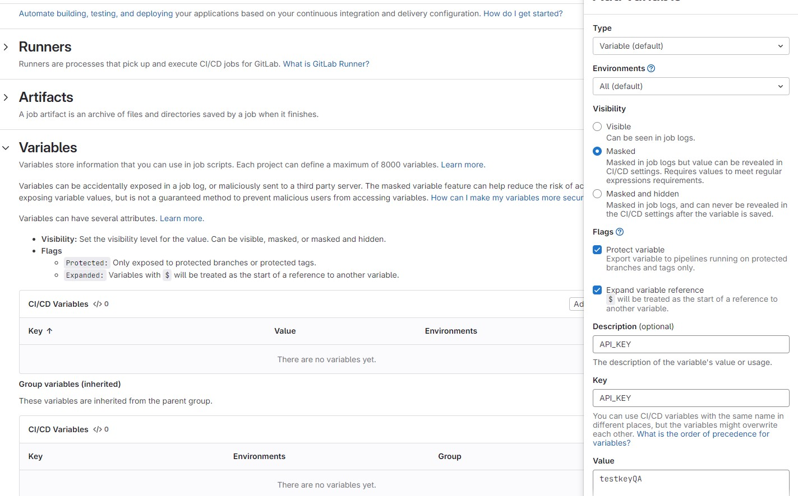
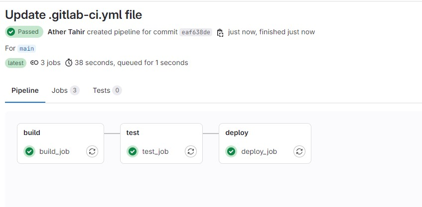
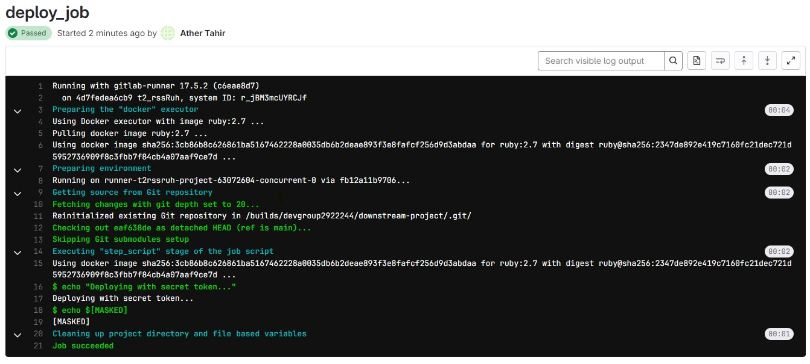

## Lab: Security Best Practices

### Overview

This lab will cover:
1. **Securing GitLab repositories and pipelines**: Protect repositories, limit access, and secure sensitive information.
2. **Best practices for GitLab CI/CD security configurations**: Use secure configurations to prevent unauthorized access and reduce risks.
3. **Demo**: Implement security measures in a CI/CD pipeline, including secret management and access control.

By the end of this guide, you will understand how to configure secure pipelines and manage sensitive information effectively.

---

### Prerequisites

1. A GitLab repository with CI/CD enabled.
2. GitLab admin access or owner-level permissions to configure repository settings.
3. Familiarity with GitLab CI/CD and YAML syntax.

---

### Part 1: Securing GitLab Repositories and Pipelines

#### 1.1 Repository Access Control

To protect your repository, follow these access control best practices:
- **Limit Access**: Use GitLab’s access roles (Guest, Reporter, Developer, Maintainer, Owner) to restrict permissions.
- **Branch Protection**: Enable branch protection for critical branches (e.g., `main` or `production`) to restrict direct pushes and require code review.

#### Example Steps:
1. Go to **Settings > Repository > Protected Branches**.
2. Choose the branch you want to protect (e.g., `main`).
3. Set permissions to **allow only Maintainers** to push and require a **merge request** for changes.




---

### Part 2: Best Practices for GitLab CI/CD Security Configurations

#### 2.1 Secret Management

Avoid hardcoding sensitive information (like API keys) in `.gitlab-ci.yml` files. Instead, use GitLab CI/CD environment variables.
1. Go to **Settings > CI/CD** and expand the **Variables** section.
2. Add sensitive information (e.g., `API_KEY`, `DB_PASSWORD`) as **masked** environment variables to hide values in the CI/CD logs.



#### `.gitlab-ci.yml` Usage:

```yaml
stages:
  - build

build_job:
  stage: build
  script:
    - echo "Building the application..."
    - echo "Using API key $API_KEY"  # $API_KEY is a masked variable from GitLab settings
```


### 2.2 Limit Job Permissions

Use rules to restrict jobs to specific branches or pipeline events.

```
deploy_job:
  stage: deploy
  script:
    - echo "Deploying to production..."
  rules:
    - if: '$CI_COMMIT_REF_NAME == "main"'  # Only allow deployment on the main branch
```


### Part 3: Demo – Security Measures in a CI/CD Pipeline

In this demo, you’ll set up a secure pipeline with secret management and access control.

#### 3.1 Demo Setup

1. Create Environment Variables:

- Go to **Settings > CI/CD > Variables**.
- Add a variable `SECRET_TOKEN`, mark it as **masked**, and use it in your pipeline.

2. Configure the Pipeline:

Add the following `.gitlab-ci.yml` file to your repository.

```
stages:
  - build
  - test
  - deploy

build_job:
  stage: build
  script:
    - echo "Building application..."

test_job:
  stage: test
  script:
    - echo "Running tests..."
  rules:
    - if: '$CI_COMMIT_REF_NAME == "main"'
    - if: '$CI_COMMIT_REF_NAME =~ /^release-.*$/'

deploy_job:
  stage: deploy
  script:
    - echo "Deploying with secret token..."
    - echo $SECRET_TOKEN  # Uses the masked variable SECRET_TOKEN
  rules:
    - if: '$CI_COMMIT_REF_NAME == "main"'  # Deploy only on main branch
    - when: manual  # Manual trigger to control deployments
```


3. **Explanation:**

- `build_job`: Runs unconditionally as a basic build step.
- `test_job`: Executes on the main branch and release branches only.
- `deploy_job`: Runs manually on the main branch, using SECRET_TOKEN securely.


4. **Run the Pipeline:**

- Push changes to the repository and observe how jobs behave according to branch and rule restrictions.
- Check that `SECRET_TOKEN` is masked in logs.





#### Summary

This lab covered:

1. Security practices for access control and branch protection.
2. Configurations for securely handling secrets and setting rules on sensitive jobs.
3. A practical demo on using secure variables and controlled job triggers.

