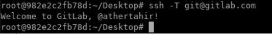
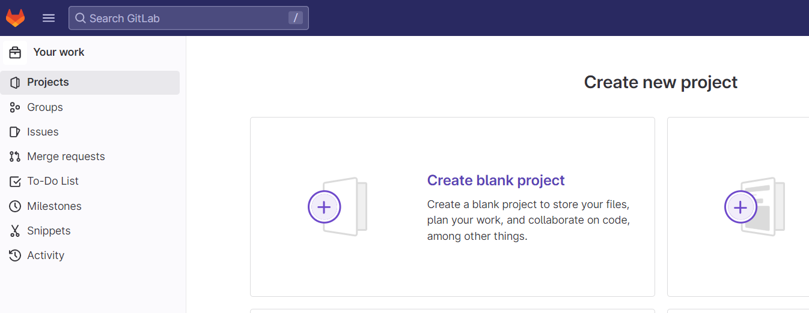

# Lab: Using SSH keys with GitLab private repositories

This lab is going to teach you a little bit about how Git works. It
walks you through the steps of creating your own project, editing a
file, and committing changes to a Git repository from the command line.

When you're done, you'll have a project where you can practice using
Git.

## What you need

Before you begin:

- Install Git on your local machine.
- Ensure you can sign in to an instance of GitLab. If your organization doesn’t have GitLab, create an account on `https://gitlab.com/`.
- Create SSH keys and add them to GitLab. SSH keys are how you securely communicate between your computer and GitLab.

## Create SSH key

SSH uses two keys, a public key and a private key.

- The public key can be distributed.
- The private key should be protected.

When you need to copy or upload your SSH public key, make sure you do not accidentally copy or upload your private key instead.

Let's create new ssh key using the VM. GitLab recommendation
is to create SSH key type ED25519, which is more secure than RSA. 

**Generate an SSH key pair**

If you do not have an existing SSH key pair, generate a new one:

1. Open a terminal.
2. Run `ssh-keygen -t` followed by the key type and an optional comment. This comment is included in the .pub file that’s created. You may want to use an email address for the comment. To create new key run following command. Text after `-C` option is a comment and you can change it.

    `ssh-keygen -t ed25519 -C "GitLab SSH key"`

3. Press `Enter`. Output similar to the following is displayed:

    ```
    Generating public/private ed25519 key pair.
    Enter file in which to save the key (~/.ssh/id_ed25519):
    ```

4. Accept the suggested filename and directory.

5. Do not specify a passphrase:

    ```
    Enter passphrase (empty for no passphrase):
    Enter same passphrase again:
    ```

A confirmation is displayed, including information about where your files are stored.


The key will be created in default directory which for linux is
`~/.ssh`. You should have two new files in `.ssh` directory:

-   `id_ed25519` --- private key
-   `id_ed25519.pub` --- public key


**Add an SSH key to your GitLab account**

To use SSH with GitLab, copy your public key to your GitLab account:

1. Copy the contents of your public key file.

```
cat ~/.ssh/id_ed25519.pub
```

2. Sign in to GitLab.
3. On the top bar, in the upper-right corner, select your avatar.
4. Select **Preferences**.
5. On the left sidebar, select SSH Keys.
6. In the Key box, paste the contents of your public key. If you manually copied the key, make sure you copy the entire key, which starts with `ssh-ed25519` and may end with a comment.
7. In the **Title** box, type a description, like `Work Laptop` or `Home Workstation`.
8. Optional. Select the **Usage type** of the key. It can be used either for Authentication or Signing or both. Authentication & Signing is the default value.
9. Optional. **Update Expiration** date to modify the default expiration date. 
10. Select **Add key**.


**Verify that you can connect**

Verify that your SSH key was added correctly.

Open a terminal and run this command, replacing gitlab.com with your GitLab instance URL:

`ssh -T git@gitlab.com`

If this is the first time you connect, you should verify the authenticity of the GitLab host. If you see a message like:

```
The authenticity of host 'gitlab.com (35.231.145.151)' can't be established.
ECDSA key fingerprint is SHA256:HbW3g8zUjNSksFbqTiUWPWg2Bq1x8xdGUrliXFzSnUw.
Are you sure you want to continue connecting (yes/no)? yes
Warning: Permanently added 'gitlab.com' (ECDSA) to the list of known hosts.
```

Type yes and press `Enter`.

Run the `ssh -T git@gitlab.com` command again. You should receive a Welcome to GitLab, @username! message.




**View your account’s SSH keys**

1. Sign in to GitLab.
2. On the top bar, in the upper-right corner, select your avatar.
3. Select Preferences.
4. On the left sidebar, select SSH Keys.
Your existing SSH keys are listed at the bottom of the page. The information includes:

- The key’s:
    * Name.
    * Public fingerprint.
    * Expiry date.
    * Permitted usage types.


## Steps

Here's an overview of what we're going to do:

1. Create a sample project.
2. Clone the repository.
3. Create a branch and make your changes.
4. Commit and push your changes.
5. Merge your changes.
6. View your changes in GitLab.


### Create a sample project

To start, create a sample project in GitLab.

1.  In GitLab, on the top bar, select **Main menu \> Projects \> View
    all projects**.
2.  On the right of the page, select **New project** > `Create blank project`.

    

3.  For **Project name**, enter `My sample project`.
    The project slug is generated for you. This slug is the URL you can
    use to access the project after it's created.
4.  Ensure **Initialize repository with a README** is selected. How you
    complete the other fields is up to you.
5.  Select **Create project**.

### Clone the repository

Now you can clone the repository in your project. *Cloning* a repository
means you're creating a copy on your computer, or wherever you want to
store and work with the files.

1.  On your project page, select **Clone**. Copy the URL for **Clone
    with SSH**.

    [](./images/clone_project_v14_9.png)

2.  Open a terminal on your computer and go to the directory where you
    want to clone the files.

3.  Enter `git clone` and paste the URL:

    ``` 
    git clone git@gitlab.com:YOUR_GITLAB_USERNAME/my-sample-project.git
    ```
    
    

4.  Go to the directory:

    ``` 
    cd my-sample-project
    ```
    
    

5.  By default, you've cloned the default branch for the repository.
    Usually this branch is `main`. To be sure, get
    the name of the default branch:

    ``` 
    git branch
    ```
    
    

    The branch you're on is marked with an asterisk. Press
    `Q` on your keyboard to return to the main
    terminal window.

### Create a branch and make changes

Now that you have a copy of the repository, create your own branch so
you can work on your changes independently.

1.  Create a new branch called
    `example-tutorial-branch`.

    ``` 
    git checkout -b example-tutorial-branch
    ```
    
    

2.  In a text editor like Visual Studio Code, Sublime,
    `nano`, or any other editor, open the README.md
    file and add this text:

    
    
    ```
    Hello world! I'm using Git!
    ```
    
    

3.  Save the file.

4.  Git keeps track of changed files. To confirm which files have
    changed, get the status.

    ``` 
    git status
    ```
    
    

    You should get output similar to the following:

    ``` 
    On branch example-tutorial-branch
    Changes not staged for commit:
    (use "git add <file>..." to update what will be committed)
    (use "git restore <file>..." to discard changes in working directory)
    modified:   README.md

    no changes added to commit (use "git add" and/or "git commit -a")
    ```
    
    

### Commit and push your changes

You've made changes to a file in your repository. Now it's time to
record those changes by making your first commit.

1.  Add the `README.md` file to the *staging* area.
    The staging area is where you put files before you commit them.

    ``` 
    git add README.md
    ```
    
    

2.  Confirm the file is staged:

    ``` 
    git status
    ```
    
    

    You should get output similar to the following, and the filename
    should be in green text.

    ``` 
    On branch example-tutorial-branch
    Changes to be committed:
    (use "git restore --staged <file>..." to unstage)
    modified:   README.md
    ```
    
    

3.  Now commit the staged file, and include a message that describes the
    change you made. Make sure you surround the message in double quotes
    (").

    ``` 
    git commit -m "I added text to the README file"
    ```
    
    

4.  The change has been committed to your branch, but your branch and
    its commits are still only available on your computer. No one else
    has access to them yet. Push your branch to GitLab:

    ``` 
    git push origin example-tutorial-branch
    ```
    
    

Your branch is now available on GitLab and visible to other users in
your project.

[](./images/branches_dropdown_v14_10.png)

### Merge your changes

Now you're ready to merge the changes from your
`example-tutorial-branch` branch to the default
branch (`main`).

1.  Check out the default branch for your repository.

    ``` 
    git checkout main
    ```
    
    

2.  Merge your branch into the default branch.

    ``` 
    git merge example-tutorial-branch
    ```
    
    

3.  Push the changes.

    ``` 
    git push
    ```
    

For this lab, you merge your branch directly to the default branch
for your repository. In GitLab, you typically use a `merge request` to merge your branch which will be created in upcoming lab.


### View your changes in GitLab

You did it! You updated the `README.md` file in your
branch, and you merged those changes into the `main`
branch.

Let's look in the UI and confirm your changes. Go to your project.

-   Scroll down and view the contents of the
    `README.md` file. Your changes should be
    visible.

-   Above the `README.md` file, view the text in the
    **Last commit** column. Your commit message is displayed in this
    column:

    [](./images/commit_message_v14_10.png)

Now you can return to the command line and change back to your personal
branch (`git checkout example-tutorial-branch`). You
can continue updating files or creating new ones. Type
`git status` to view the status of your changes and
commit with abandon.


Lab : Gitlab Branches
----------------------

Fork is a duplicate of your original repository in which you can make
the changes without affecting the original project.

#### Forking a Project

**Step 1** − To fork a project, Open following URL after login in your gitlab account and click on the *Fork* button as shown
below −

`https://gitlab.com/gitlab-org/container-registry`


**Step 2** − After clicking the `Fork` button the project, enter project name as shown below:


**Step 3** − Next it will start processing of forking a project for
sometime as shown below −


**Step 4** − It will display the success message after completion of
forking the project process −


### GitLab - Create a Branch

Branch is independent line and part of the development process. The
creation of branch involves following steps.

#### Creating a Branch

**Step 1** − Login to your GitLab account and go to your project under
*Projects* section.


**Step 2** − To create a branch, click on the *Branches* option under
the *Repository* section and click on the *New branch* button.


**Step 3** − In the *New branch* screen, enter the name for branch and
click on the *Create branch* button.


**Step 4** − After creating branch, you will get a below screen along
with the created branch.


### GitLab - Delete a Branch

**Step 1** − To create a branch, click on the *Branches* option under
the *Repository* section and click on the *Delete* button next to branch name.


**Step 2** − Confirm to delete branch as shown below:


## Lab: Managing Merge Requests

There are many different ways to create a merge request.


### Task: Make changes in Gitlab Repo

1. Switch to `example-tutorial-branch` in terminal of repo created in lab 3.
2.  Make changes in `README.md` and push the changes.

    

## From the merge request list

You can create a merge request from the list of merge requests.

1.  On the top bar, select **Main menu \> Projects** and find your
    project.
2.  On the left menu, select **Merge requests**.
3.  In the upper right, select **New merge request**.

    

4.  Select a source and target branch and then **Compare branches and continue**.

    

5.  Fill out the fields and select **Create merge request**.

    

Merge requests are designed around a one-to-one (1:1) branch
relationship. Only one open merge request may be associated with a given
target branch at a time.

6. You can merge the **merge request** as shown below:

    


### Revert a merge request

You can revert an entire merge request in GitLab.
When you revert a commit in Git, you create a new commit that reverses
all actions taken in the original commit:


After a merge request is merged, you can revert all changes in the merge
request.

**Prerequisites:**

-   You must have a role in the project that allows you to edit merge
    requests, and add code to the repository.
-   Your project must use the [merge method]
    **Merge Commit**, which is set in the project's **Settings \>
    General \> Merge request**. You can't revert fast-forwarded commits
    from the GitLab UI.

To do this:

1.  On the top bar, select **Main menu \> Projects** and find your
    project.
2.  On the left sidebar, select **Merge requests** and identify your
    merge request.
3.  Scroll to the merge request reports area, and find the report
    showing when the merge request was merged.
4.  Select **Revert**.

    

5.  In **Revert in branch**, select the branch to revert your changes
    into.
6.  Optional. Select **Start a new merge request** to start a new merge
    request with the new revert commit.
7.  Select **Revert**.

    

The option to **Revert** is no longer shown after a merge request is
reverted.


## Task Create Merge Request: When you add, edit, or upload a file

You can create a merge request when you add, edit, or upload a file to a
repository.

1.  [Add, edit, or upload] a file to the repository.
2.  In the **Commit message**, enter a reason for the commit.
3.  Select the **Target branch** or create a new branch by typing the
    name (without spaces, capital letters, or special chars).
4.  Select the **Start a new merge request with these changes** checkbox
    or toggle. This checkbox or toggle is visible only if the target is
    not the same as the source branch, or if the source branch is
    protected.
5.  Select **Commit changes**.

## Task Create Merge Request: When you create a branch

You can create a merge request when you create a branch.

1.  On the top bar, select **Main menu \> Projects** and find your
    project.
2.  On the left menu, select **Repository \> Branches**.
3.  Type a branch name and select **New branch**.
4.  Above the file list, on the right side, select **Create merge
    request**. A merge request is created. The default branch is the
    target.
5.  Fill out the fields and select **Create merge request**.

## Task Create Merge Request: When you use Git commands locally

You can create a merge request by running Git commands on your local
machine.

1.  Create a branch:

    ``` 
    git checkout -b my-new-branch
    ```
    
    

2.  Create, edit, or delete files. The stage and commit them:

    ``` 
    git add .
    git commit -m "My commit message"
    ```
    
    

3.  Push your branch to GitLab:

    ``` 
    git push origin my-new-branch
    ```
    
    

    GitLab prompts you with a direct link for creating a merge request:

    
    
    ```
    ...
    remote: To create a merge request for my-new-branch, visit:
    remote:   https://gitlab.com/YOUR_USERNAME/my-project/merge_requests/new?merge_request%5Bsource_branch%5D=my-new-branch
    ```
    
    
4.  Copy the link and paste it in your browser.


### Lab: Managing Merge Conflicts

*Merge conflicts* happen when the two branches in a merge request (the
source and target) each have different changes, and you must decide
which change to accept. In a merge request, Git compares the two
versions of the files line by line. In most cases, GitLab can merge
changes together. However, if two branches both change the same lines,
GitLab blocks the merge, and you must choose which change you want to
keep.

## Conflicts you can resolve in the user interface

If your merge conflict meets all of the following conditions, you can
resolve the merge conflict in the GitLab user interface:

-   The file is text, not binary.
-   The file is in a UTF-8 compatible encoding.
-   The file does not already contain conflict markers.
-   The file, with conflict markers added, is less than 200 KB in size.
-   The file exists under the same path in both branches.

If any file in your merge request contains conflicts, but can't meet all
of these criteria, you must resolve the conflict manually.

**Note:** Create blank new repository `merge-conflict-lab` before starting this lab.

### Activity: Create your own conflict

1. Create new branch `my-resume` from `main` branch.
   

2. Select `main` branch and create a new file called `references.md`, add some text and push that change to `main`, without updating your `my-resume` branch.
   

3. Browse to the `my-resume` branch.
4. Click the dropdown menu and then on `New file`.
5. Create a file named `references.md`.
6. Enter some text that conflicts with what we added for `references.md` in the `main` branch.
   

7. Scroll to the bottom of the page and enter a commit message for your change.
8. Click the **Commit Changes** button.

### Activity: Create Merge Request

1.  On the top bar, select **Main menu \> Projects** and find your
    project.

2.  On the left sidebar, select **Merge requests** and create the merge
    request.
   


### Methods of resolving conflicts

GitLab shows conflicts available for resolution
in the user interface, and you can also resolve conflicts locally
through the command line:

- `Interactive mode`: UI method best for conflicts that only require you to select which
    version of a line to keep, without edits.
- `Inline editor`: UI method best for more complex conflicts that require you to edit
    lines and manually blend changes together.
- `Command line`: provides complete control over the most complex conflicts.

### Resolve conflicts in interactive mode

To resolve less-complex conflicts from the GitLab user interface:

1.  On the top bar, select **Main menu \> Projects** and find your
    project.

2.  On the left sidebar, select **Merge requests** and find the merge
    request.

3.  Select **Overview**, and scroll to the merge request reports
    section.

4.  Find the merge conflicts message, and select **Resolve conflicts**.
    GitLab shows a list of files with merge conflicts. The conflicts are
    highlighted:
    

    

5.  For each conflict, select **Use ours** or **Use theirs** to mark the
    version of the conflicted lines you want to keep. This decision is
    known as "resolving the conflict."

6.  Enter a **Commit message**.

7.  **Note:** You can select **Commit to source branch** to resolve conflict but let's explore another option in the next step first.


## Resolve conflicts in the inline editor

Some merge conflicts are more complex, requiring you to manually modify
lines to resolve their conflicts. Use the merge conflict resolution
editor to resolve complex conflicts in the GitLab interface:

1.  On the top bar, select **Main menu \> Projects** and find your
    project.
2.  On the left sidebar, select **Merge requests** and find the merge
    request.
3.  Select **Overview**, and scroll to the merge request reports
    section.
4.  Find the merge conflicts message, and select **Resolve conflicts**.
    GitLab shows a list of files with merge conflicts.
5.  Select **Edit inline** to open the editor: 
    

6.  After you resolve the conflict, enter a **Commit message**.
7.  Select **Commit to source branch**.
8. After resolving the conflict(s), `Merge Request` is ready for merge:
    


Resolve Merge Conflict Locally
===============================

In this section, we will work on resolving merge conflicts.


**Creating a merge conflict**

Here, we will show you a simulation of how merge conflicts appear.


``` 
cd ~/Desktop
mkdir test-dir
cd test-dir
git init .
echo "some content" > example.txt
git add example.txt
git commit -am "initial commit"

[master (root-commit) a45c22d] initial commit
1 file changed, 1 insertion(+)
create mode 100524 example.txt
```


In the given example, we create a **test-dir** new directory. Next, we
create **example.txt** text file with some content and add it to the
repository and commit it. As a result, we have a new repository with one
master branch and **example.txt** file. The next step is creating
another branch to use as a conflicting merge.


``` 
git checkout -b branch_to_merge
echo "completely different content to merge later" > example.txt
git commit -am "edit the content of example.txt to make a conflict"

[branch_to_merge 4221135] edit the content of example.txt to make a conflict
1 file changed, 1 insertion(+), 1 deletion(-)
```


In the above example, we create and check out **branch\_to\_merge**
branch. After creating, we overwrite the content in **example.txt** file
and commit the new content. After doing all this, the commit overrides
the content of **example.txt:**


``` 
git checkout master
Switched to branch 'master'
echo "content to add" >> example.txt
git commit -am "added content to example.txt"
[master 11ab34b] added content to example.txt
1 file changed, 1 insertion(+)
```


This bunch of commands checks out the master branch attaching the
content to **example.txt** and committing it. So, our repository is put
to the state where we have one commit in the master branch and one in
the **branch\_to\_merge** branch. The final step is to execute the [git
merge]{.kbd .highlighted} command after which conflict will occur:


``` 
git merge branch_to_merge
Auto-merging example.txt
CONFLICT (content): Merge conflict in example.txt
Automatic merge failed; fix conflicts and then commit the result.
```


Identifying merge conflicts
---------------------------

As we have already seen, Git displays output which indicates that a
conflict has appeared. Execute the `git status` command to see
the unmerged paths:


``` 
git status
On branch master
You have unmerged paths.
(fix conflicts and run "git commit")
(use "git merge --abort" to abort the merge)
Unmerged paths:
(use "git add <file>..." to mark resolution)
both modified:   example.txt
```


The example.txt file appears in a modified state. Execute **cat**
command to put out the contents of the example.txt file. We can see
these visual marks:


``` 
<<<<<<< HEAD
=======
>>>>>>> branch_to_merge
```


The **=======** marks is the center of the conflict. The content between
the center and the HEAD line is the content existing in the current
branch master that the HEAD reference is pointing to. Read more about
visual marks on the [git merge]{.kbd .highlighted} page.

Resolving merge conflicts
-------------------------

To resolve a merge conflict you should edit the conflicted file. Open
the **example.txt** file in the editor and remove all the marks. The
changed file has the following look:


``` 
some content to mess with
content to add
completely different content to merge later
```


Execute the `git add`
command to stage the new merge content. Next, create a new commit to
complete the merge:


``` 
git add .
git commit -m "the conflict in example.txt is merged and resolved"
```

