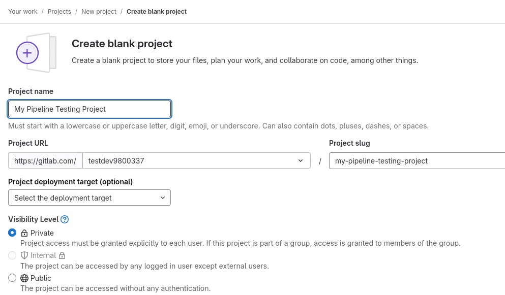
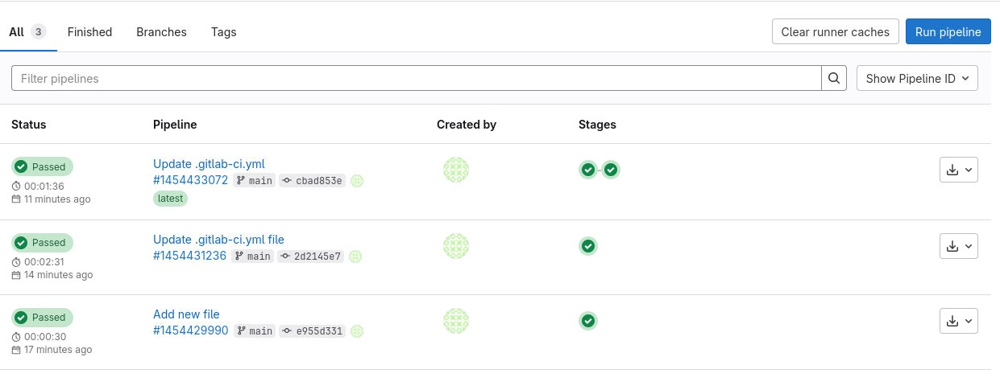
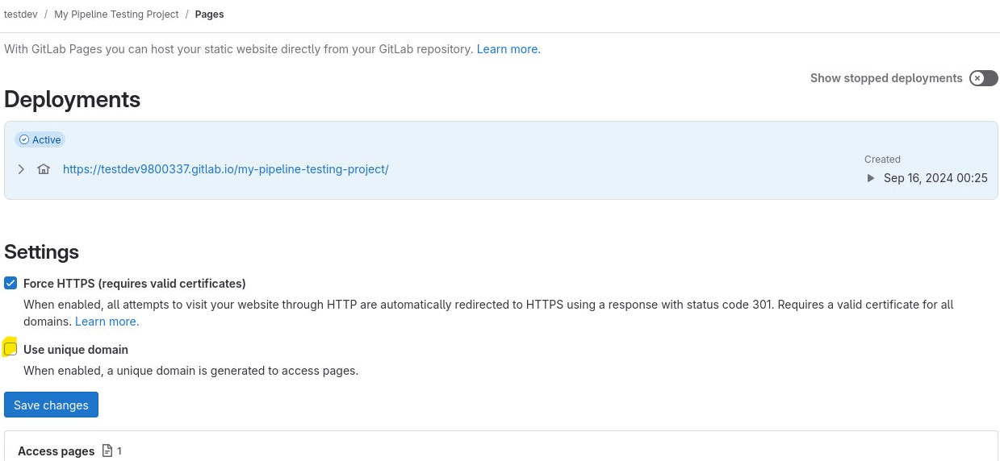

## Lab 3: Comprehensive Testing

This lab walks you through configuring a progressively more complex CI/CD pipeline through small, iterative steps. The pipeline is always fully functional, but it gains more functionality with each step. The goal is to build, test, and deploy a documentation site.

When you finish this lab, you will have a new project on GitLab.com and a working documentation site using Docusaurus.

To complete this lab, you will:

- Create a project to hold the Docusaurus files
- Create the initial pipeline configuration file
- Add a job to build the site
- Add a job to deploy the site
- Add test jobs
- Start using merge request pipelines
- Reduce duplicated configuration

**Prerequisites**

- You need an account on GitLab.com.
- You should be familiar with Git.
- Node.js must be installed.


**Create a project to hold the Docusaurus files**

Before adding the pipeline configuration, you must first set up a Docusaurus project on GitLab.com:

1. Create a new project under your group (which has runner running):
    - On the left sidebar, at the top, select **Create new (+)** and New **project/repository**.
    - Select **Create blank project**.
    - Enter the project details:
        * In the **Project** name field, enter the name of your project, for example **My Pipeline Testing Project**.
        * Select Initialize repository with a README.
    - Select Create project.



2. On the project’s overview page, in the upper-right corner, select **Code** to find the clone paths for your project. Copy the SSH or HTTP path and use the path to clone the project locally.

For example, to clone with SSH into a pipeline-testing directory in your lab environment:

```
git clone git@gitlab.com:my-username/my-pipeline-testing-project.git pipeline-testing
```

Change to the project’s directory, then generate a new Docusaurus site:

```
cd pipeline-testing
npm init docusaurus
```

The Docusaurus initialization wizard prompts you with questions about the site. Use all the default options.

The initialization wizard sets up the site in `website/`, but the site should be in the root of the project. Move the files up to the root and delete the old directory:

```
mv website/* .
rm -r website
```

Update the Docusaurus configuration file with the details of your GitLab project. In `docusaurus.config.js`:

- Set `url`: to a path with this format: `https://<my-username>.gitlab.io/`.
- Set `baseUrl`: to your project name, like `/my-pipeline-testing-project/`.

Commit the changes, and push them to GitLab:

```
git add .
git commit -m "Add simple generated Docusaurus site"
git push origin
```

**Create the initial CI/CD configuration file**

Start with the simplest possible pipeline configuration file to ensure CI/CD is enabled in the project and runners are available to run jobs.

**Important!** 

Disable instance runners for the project that you created. Otherwise, gitlab will fail your pipeline and ask for account verification.


This step introduces:

- `Jobs`: These are self-contained parts of a pipeline that run your commands. Jobs run on runners, separate from the GitLab instance.

- `script`: This section of a job’s configuration is where you define the commands for jobs. If there are multiple commands (in an array), they run in order. Each command executes as if it was run as a CLI command. By default, if a command fails or returns an error, the job is flagged as failed and no more commands run.

**Note:** Make sure to disable shared runner first.

In this step, create a .gitlab-ci.yml file in the root of the project with this configuration:

```
test-job:
  script:
    - echo "This is my test job!"
    - date
```

Commit and push this change to GitLab, then:

1. Go to **Build > Pipelines** and make sure a pipeline runs in GitLab with this single job.
2. Select the pipeline, then select the job to view the job’s log and see the This is my first job! message followed by the date.

Now that you have a `.gitlab-ci.yml` file in your project, you can make all future changes to pipeline configuration with the pipeline editor.

#### Add a job to build the site

A common task for a CI/CD pipeline is to build the code in the project then deploy it. Start by adding a job that builds the site.

This step introduces:

- `image`: Tell the runner which Docker container to use to run the job in. The runner:
    1. Downloads the container image and starts it.
    2. Clones your GitLab project into the running container.
    3. Runs the script commands, one at a time.

- `artifacts`: Jobs are self-contained and do not share resources with each other. If you want files generated in one job to be used in another job, you must save them as artifacts first. Then later jobs can retrieve the artifacts and use the generated files.

In this step, replace `test-job` with `build-job`:


- Use `image` to configure the job to run with the latest `node` image. Docusaurus is a Node.js project and the node image has the needed npm commands built in.
- Run `npm install` to install Docusaurus into the running node container, then run `npm run build` to build the site.

Docusaurus saves the built site in build/, so save these files with artifacts.

```
build-job:
  image: node
  script:
    - npm install
    - npm run build
  artifacts:
    paths:
      - "build/"
```

Use the pipeline editor to commit this pipeline configuration to the default branch, and check the job log. You can:

- See the npm commands run and build the site.
- Verify that the artifacts are saved at the end.
- Browse the contents of the artifacts file by selecting **Browse** to the right of the job log after the job completes.

**Add a job to deploy the site**

After verifying the Docusaurus site builds in build-job, you can add a job that deploys it.

This step introduces:

- `stage` and `stages`: The most common pipeline configurations group jobs into stages. Jobs in the same stage can run in parallel, while jobs in later stages wait for jobs in earlier stages to complete. If a job fails, the whole stage is considered failed and jobs in later stages do not start running.
- `GitLab Pages`: To host your static site, you will use GitLab Pages.

In this step:

- Add a job that fetches the built site and deploys it. When using GitLab Pages, the job is always named pages. The artifacts from the build-job are fetched automatically and extracted into the job. Pages looks for the site in the public/ directory though, so add a script command to move the site to that directory.
- Add a `stages` section, and define the stages for each job. `build-job` runs first in the `build` stage, and pages runs after in the `deploy` stage.

```
stages:          # List of stages for jobs and their order of execution
  - build
  - deploy

build-job:
  stage: build   # Set this job to run in the `build` stage
  image: node
  script:
    - npm install
    - npm run build
  artifacts:
    paths:
      - "build/"

pages:
  stage: deploy  # Set this new job to run in the `deploy` stage
  script:
    - mv build/ public/
  artifacts:
    paths:
      - "public/"
```




Use the pipeline editor to commit this pipeline configuration to the default branch, and view the pipeline details from the Pipelines list. Verify that:

- The two jobs run in different stages, `build` and `deploy`.
- After the `pages` job completes a `pages:deploy` job appears, which is the GitLab process that deploys the Pages site. When that job completes, you can visit your new Docusaurus site.

To view your site:

- On the left sidebar, select **Deploy** > **Pages**.
- **Important:** Make sure **Use unique domain** is off.


- Under **Access pages**, select the link. The URL format should be similar to: `https://<my-username>.gitlab.io/<project-name>`.


**Note**
If you are unable to view the deployed site, do following steps:

- In **docusaurus.config.js**. Set `url` to a path with this format: `https://UPDATE_GROUP_ID.gitlab.io/`. You can get the group name from create project screen:


- Update and push the code and run the complete pipeline again.


**Add test jobs**

Now that the site builds and deploys as expected, you can add tests and linting. For example, a Ruby project might run RSpec test jobs. Docusaurus is a static site that uses Markdown and generated HTML, so this adds jobs to test the Markdown and HTML.

This step introduces:

- `allow_failure`: Jobs that fail intermittently, or are expected to fail, can slow down productivity or be difficult to troubleshoot. Use allow_failure to let jobs fail without halting pipeline execution.
- `dependencies`: Use dependencies to control artifact downloads in individual jobs by listing which jobs to fetch artifacts from.

In this step:

- Add a new `test` stage that runs between `build` and `deploy`. These three stages are the default stages when stages is undefined in the configuration.

- Add a `lint-markdown` job to run markdownlint and check the Markdown in your project. markdownlint is a static analysis tool that checks that your Markdown files follow formatting standards.
    * The sample Markdown files Docusaurus generates are in `blog/` and `docs/`.
    * This tool scans the original Markdown files only, and does not need the generated HTML saved in the build-job artifacts. Speed up the job with `dependencies: []` so that it fetches no artifacts.
    * A few of the sample Markdown files violate default markdownlint rules, so add allow_failure: true to let the pipeline continue despite the rule violations.

- Add a test-html job to run HTMLHint and check the generated HTML. HTMLHint is a static analysis tool that scans generated HTML for known issues.

- Both `test-html` and `pages` need the generated HTML found in the build-job artifacts. Jobs fetch artifacts from all jobs in earlier stages by default, but add `dependencies:` to make sure the jobs don’t accidentally download other artifacts after future pipeline changes.

```
stages:
  - build
  - test               # Add a `test` stage for the test jobs
  - deploy

build-job:
  stage: build
  image: node
  script:
    - npm install
    - npm run build
  artifacts:
    paths:
      - "build/"

lint-markdown:
  stage: test
  image: node
  dependencies: []     # Don't fetch any artifacts
  script:
    - npm install markdownlint-cli2 --global           # Install markdownlint into the container
    - markdownlint-cli2 -v                             # Verify the version, useful for troubleshooting
    - markdownlint-cli2 "blog/**/*.md" "docs/**/*.md"  # Lint all markdown files in blog/ and docs/
  allow_failure: true  # This job fails right now, but don't let it stop the pipeline.

test-html:
  stage: test
  image: node
  dependencies:
    - build-job        # Only fetch artifacts from `build-job`
  script:
    - npm install --save-dev htmlhint                  # Install HTMLHint into the container
    - npx htmlhint --version                           # Verify the version, useful for troubleshooting
    - npx htmlhint build/                              # Lint all markdown files in blog/ and docs/

pages:
  stage: deploy
  dependencies:
    - build-job        # Only fetch artifacts from `build-job`
  script:
    - mv build/ public/
  artifacts:
    paths:
      - "public/"
```


Commit this pipeline configuration to the default branch, and view the pipeline details.


- The lint-markdown job fails because the sample Markdown violates the default markdownlint rules, but is allowed to fail. You can:
    * Ignore the violations for now. They do not need to be fixed as part of the lab.
    * Fix the Markdown file violations. Then you can change `allow_failure` to `false`, or remove allow_failure completely because `allow_failure: false` is the default behavior when not defined.
    * Add a markdownlint configuration file to limit which rule violations to alert on.

- You can also make changes to the Markdown file content and see the changes on the site after the next deployment.

**Start using merge request pipelines**

With the pipeline configurations above, the site deploys every time a pipeline completes successfully, but this is not an ideal development workflow. It’s better to work from feature branches and merge requests, and only deploy the site when changes merge to the default branch.

This step introduces:

- `rules`: Add rules to each job to configure in which pipelines they run. You can configure jobs to run in merge request pipelines, scheduled pipelines, or other specific situations. Rules are evaluated from top to bottom, and if a rule matches, the job is added to the pipeline.

- `CI/CD variables`: use these environment variables to configure job behavior in the configuration file and in script commands. Predefined CI/CD variables are variables that you do not need to manually define. They are automatically injected into pipelines so you can use them to configure your pipeline. Variables are usually formatted as `$VARIABLE_NAME`. and predefined variables are usually prefixed with `$CI_`.

In this step:

- Create a new feature branch and make the changes in the branch instead of the default branch.

- Add `rules` to each job:
    * The site should only deploy for changes to the default branch.
    * The other jobs should run for all changes in merge requests or the default branch.

- With this pipeline configuration, you can work from a feature branch without running any jobs, which saves resources. When you are ready to validate your changes, create a merge request and a pipeline runs with the jobs configured to run in merge requests.

- When your merge request is accepted and the changes merge to the default branch, a new pipeline runs which also contains the `pages` deployment job. The site deploys if no jobs fail.

```
stages:
  - build
  - test
  - deploy

build-job:
  stage: build
  image: node
  script:
    - npm install
    - npm run build
  artifacts:
    paths:
      - "build/"
  rules:
    - if: $CI_PIPELINE_SOURCE == 'merge_request_event'  # Run for all changes to a merge request's source branch
    - if: $CI_COMMIT_BRANCH == $CI_DEFAULT_BRANCH       # Run for all changes to the default branch

lint-markdown:
  stage: test
  image: node
  dependencies: []
  script:
    - npm install markdownlint-cli2 --global
    - markdownlint-cli2 -v
    - markdownlint-cli2 "blog/**/*.md" "docs/**/*.md"
  allow_failure: true
  rules:
    - if: $CI_PIPELINE_SOURCE == 'merge_request_event'  # Run for all changes to a merge request's source branch
    - if: $CI_COMMIT_BRANCH == $CI_DEFAULT_BRANCH       # Run for all changes to the default branch

test-html:
  stage: test
  image: node
  dependencies:
    - build-job
  script:
    - npm install --save-dev htmlhint
    - npx htmlhint --version
    - npx htmlhint build/
  rules:
    - if: $CI_PIPELINE_SOURCE == 'merge_request_event'  # Run for all changes to a merge request's source branch
    - if: $CI_COMMIT_BRANCH == $CI_DEFAULT_BRANCH       # Run for all changes to the default branch

pages:
  stage: deploy
  dependencies:
    - build-job
  script:
    - mv build/ public/
  artifacts:
    paths:
      - "public/"
  rules:
    - if: $CI_COMMIT_BRANCH == $CI_DEFAULT_BRANCH      # Run for all changes to the default branch only
```


Merge the changes in your merge request. This action updates the default branch. Verify that the new pipeline contains the pages job that deploys the site.

Be sure to use feature branches and merge requests for all future changes to pipeline configuration. Other project changes, like creating a Git tag or adding a pipeline schedule, do not trigger pipelines unless you add rules for those cases too.

**Reduce duplicated configuration**

The pipeline now contains three jobs that all have identical rules and image configuration. Instead of repeating these rules, use extends and default to create single sources of truth.

This step introduces:

- `Hidden jobs`: Jobs that start with . are never added to a pipeline. Use them to hold configuration you want to reuse.
- `extends`: Use extends to repeat configuration in multiple places, often from hidden jobs. If you update the hidden job’s configuration, all jobs extending the hidden job use the updated configuration.
- `default`: Set keyword defaults that apply to all jobs when not defined.
- `YAML overriding`: When reusing configuration with extends or default, you can explicitly define a keyword in the job to override the extends or default configuration.

In this step:

- Add a `.standard-rules` hidden job to hold the rules that are repeated in `build-job`, `lint-markdown`, and `test-html`.
- Use `extends` to reuse the .standard-rules configuration in the three jobs.
- Add a `default` section to define the image default as node.
- The `pages` deployment job does not need the default node image, so explicitly use busybox, an extremely tiny and fast image.

```
stages:
  - build
  - test
  - deploy

default:               # Add a default section to define the `image` keyword's default value
  image: node

.standard-rules:       # Make a hidden job to hold the common rules
  rules:
    - if: $CI_PIPELINE_SOURCE == 'merge_request_event'
    - if: $CI_COMMIT_BRANCH == $CI_DEFAULT_BRANCH

build-job:
  extends:
    - .standard-rules  # Reuse the configuration in `.standard-rules` here
  stage: build
  script:
    - npm install
    - npm run build
  artifacts:
    paths:
      - "build/"

lint-markdown:
  stage: test
  extends:
    - .standard-rules  # Reuse the configuration in `.standard-rules` here
  dependencies: []
  script:
    - npm install markdownlint-cli2 --global
    - markdownlint-cli2 -v
    - markdownlint-cli2 "blog/**/*.md" "docs/**/*.md"
  allow_failure: true

test-html:
  stage: test
  extends:
    - .standard-rules  # Reuse the configuration in `.standard-rules` here
  dependencies:
    - build-job
  script:
    - npm install --save-dev htmlhint
    - npx htmlhint --version
    - npx htmlhint build/

pages:
  stage: deploy
  image: busybox       # Override the default `image` value with `busybox`
  dependencies:
    - build-job
  script:
    - mv build/ public/
  artifacts:
    paths:
      - "public/"
  rules:
    - if: $CI_COMMIT_BRANCH == $CI_DEFAULT_BRANCH
```


Use a merge request to commit this pipeline configuration to the default branch. The file is simpler, but it should have the same behavior as the previous step.